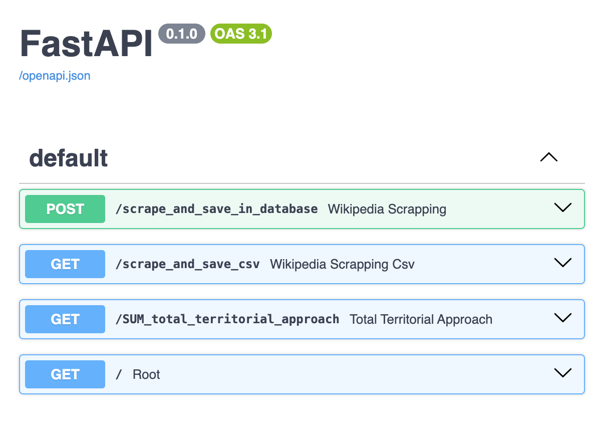
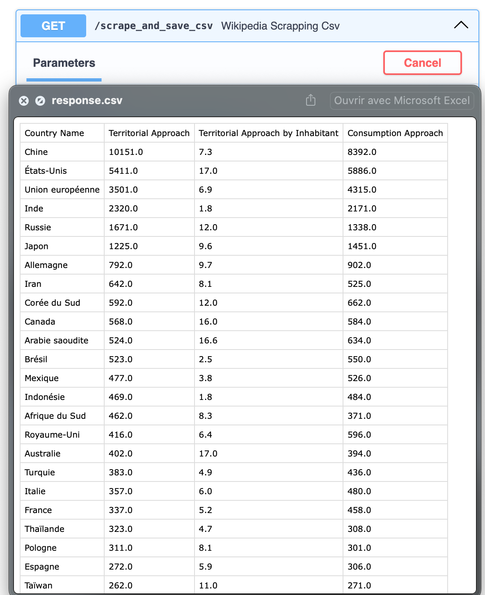
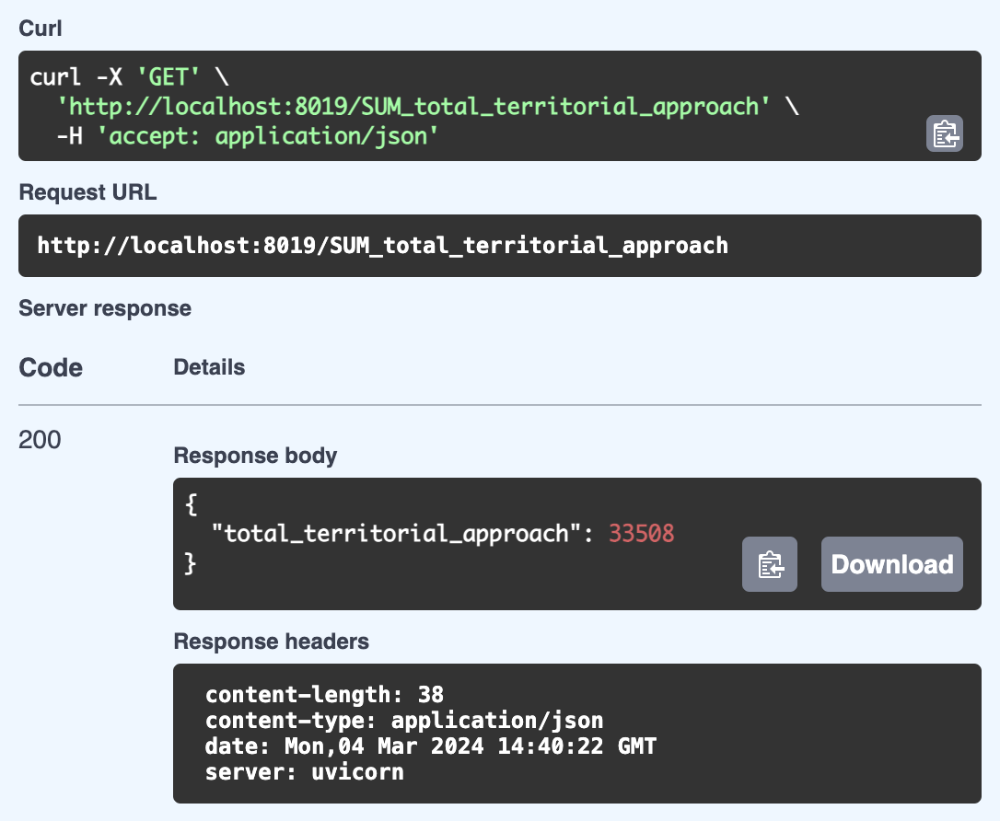

# Projet Scraping des émissions de CO2 par pays

Projet simple d'API permettant de récupérer les informations du tableau "Émissions de CO2 dues aux combustibles fossiles des principaux pays en 2015" de la page Wikipedia française **"Gaz à effet de serre"**.
[Lien de la page Wikipedia](https://fr.wikipedia.org/wiki/Gaz_à_effet_de_serre)


### Usages (3)
- /scrape_and_save_csv : génération d'un csv de ce tableau 
- /scrape_and_save_in_database : enregistrer en base de données les données du tableau
- /SUM_total_territorial_approach : générer la somme de la colonne "total_territorial_approach"


### Technologies utilisées
- Python
- Docker
- MySQL
- Librairies Python : requests, beautifulsoup4, sqlalchemy, uvicorn, fastapi, mysql-connector-python


# Base de données
Sur phpMyAdmin, code pour créer la base de données associée au scrapping
```sql
CREATE TABLE `emissions_by_country` (
  `country_name` varchar(255) NOT NULL,
  `territorial_approach` double DEFAULT NULL,
  `territorial_approach_by_inhabitant` double DEFAULT NULL,
  `consumption_approach` double DEFAULT NULL
) ENGINE=InnoDB DEFAULT CHARSET=utf8;
```


# Screenshots

## # Interface de l'API


## # Génération du CSV


## # Agrégation : Calcul de la somme des émissions


